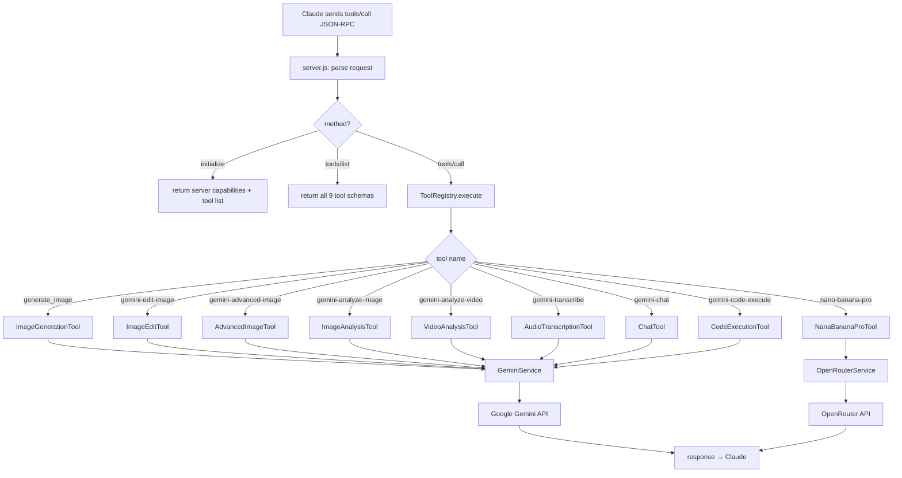
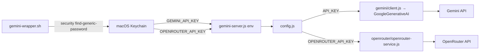
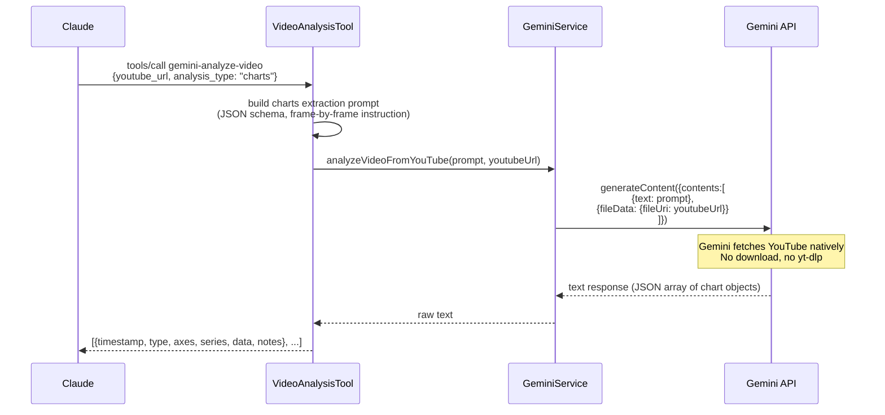
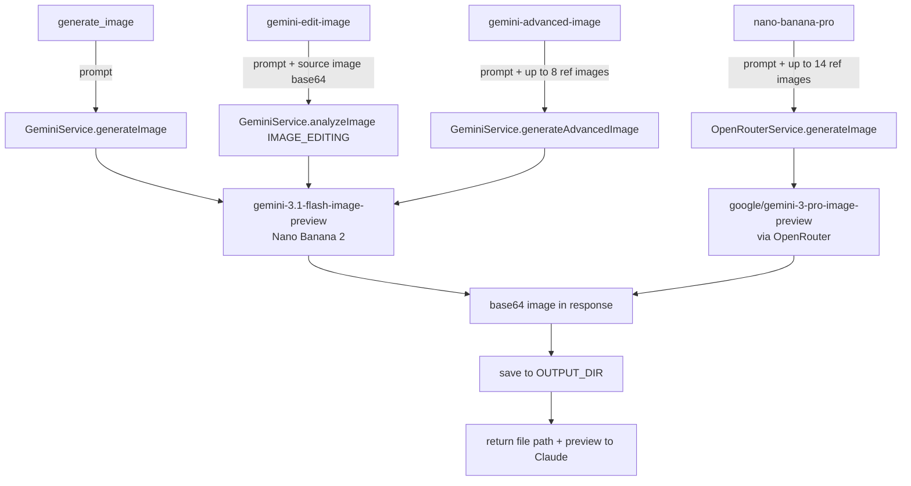

# Architecture

## Overview

stdio MCP server. Claude sends JSON-RPC over stdin, gets responses over stdout. No HTTP, no daemon — the process lives only while Claude needs it.

```
Claude Code  ──stdin──▶  gemini-server.js  ──HTTPS──▶  Google Gemini API
             ◀─stdout──                    ◀──────────
                                  │
                                  └──HTTPS──▶  OpenRouter API  (nano-banana-pro only)
```

---

## Tool dispatch



---

## Auth / credential flow



Keys never touch disk — always read from Keychain at process start.

---

## YouTube chart extraction



**Key**: `fileData.fileUri` accepts YouTube URLs directly — Gemini handles the fetch. No local download step.

---

## File I/O flow (local files)

```mermaid
flowchart TD
    A[tool receives file_path] --> B[file-utils.js: readFileAsBuffer]
    B --> C{ALLOW_UNRESTRICTED_FILE_ACCESS?}
    C -->|true default| D[read any path]
    C -->|false| E{path in ALLOWED_DIRS?}
    E -->|yes| D
    E -->|no| F[throw: access denied]
    D --> G[validateFileSize — max 20MB images / 100MB video]
    G --> H[getMimeType — extension → MIME map]
    H --> I[base64 encode]
    I --> J[GeminiService.analyzeImage / analyzeVideo / transcribeAudio]
    J --> K[inlineData: {data: base64, mimeType}]
    K --> L[Gemini API]
    L --> M[response → tool → Claude]
```

Output files (generated images) go to `~/Pictures/gemini-output/` by default, configurable via `OUTPUT_DIR` env.

---

## Image generation paths


